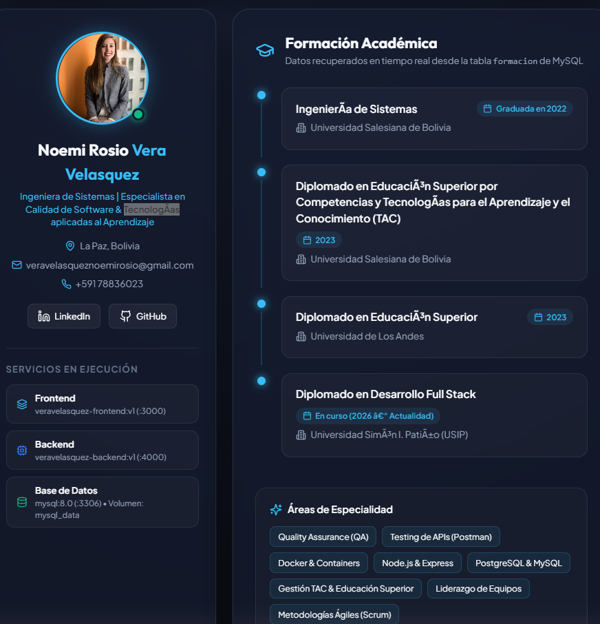

# INFORME TÉCNICO DE ENTREGA - PRÁCTICA FINAL
## Despliegue de Aplicación Web de CV Personal con Docker Compose, React, Node.js y MySQL

---

**Institución:** Universidad Simón I. Patiño (USIP)  
**Diplomado:** Desarrollo Web Full Stack & DevOps  
**Módulo 8:** Contenedores y Docker  
**Estudiante:** Ing. Noemi Rosio Vera Velasquez  
**Fecha de Entrega:** Octubre 2026  
**Docente:** Ing. Marco Antonio Via  

---

## 1. 🌐 URL del Repositorio en GitHub

El código fuente completo de la solución se encuentra publicado y versionado en el siguiente repositorio oficial:

* **Repositorio GitHub:** [https://github.com/NoeVelasquez/practica-final-docker](https://github.com/NoeVelasquez/practica-final-docker)

---

## 2. 🏷️ Nombres de las Imágenes en Docker Hub

Cumpliendo con la nomenclatura reglamentaria requerida (`apellido-frontend:v1` y `apellido-backend:v1`):

| Servicio | Nombre de Imagen en Docker Hub | Arquitectura Base | Puerto de Exposición |
| :--- | :--- | :--- | :---: |
| **Frontend Web** | `NoeVelasquez/veravelasquez-frontend:v1` | `nginx:1.27-alpine` (Multi-stage con Node.js 20) | `3000` |
| **Backend API** | `NoeVelasquez/veravelasquez-backend:v1` | `node:20-alpine` | `4000` |
| **Database** | `mysql:8.0` (Oficial) | `mysql:8.0` | `3306` |

---

## 3. 🚀 Comando Único para Iniciar la Aplicación

Toda la infraestructura, creación de redes, volúmenes, inicialización de datos y arranque de servicios se ejecuta con un único comando:

```bash
docker compose up -d
```

---

## 4. 📖 Instrucciones de Ejecución del Proyecto

### Requisitos Previos:
* Docker Engine 20.10+ y Docker Compose v2 instalados.
* Git instalado en el sistema.

### Pasos de Despliegue:

1. **Clonar el repositorio:**
   ```bash
   git clone https://github.com/NoeVelasquez/practica-final-docker.git
   cd practica-final-docker
   ```

2. **Iniciar toda la solución multicontenedor:**
   ```bash
   docker compose up -d
   ```

3. **Verificar el estado de los contenedores:**
   ```bash
   docker compose ps
   ```

4. **Acceder a la aplicación:**
   * **Interfaz Web (Frontend):** [http://localhost:3000](http://localhost:3000)
   * **Endpoint de Datos CV (JSON):** [http://localhost:4000/cv](http://localhost:4000/cv)
   * **Endpoint de Salud (Healthcheck):** [http://localhost:4000/health](http://localhost:4000/health)

5. **Detener la aplicación:**
   ```bash
   docker compose down
   ```

---

## 5. 🏛️ Arquitectura del Sistema

```
                       ┌────────────────────────────┐
                       │  Navegador Web del Cliente │
                       └──────────────┬─────────────┘
                                      │
              ┌───────────────────────┴───────────────────────┐
              │ HTTP :3000                                    │ HTTP :4000
              ▼                                               ▼
   ┌───────────────────────┐                       ┌───────────────────────┐
   │    Frontend (Nginx)   │                       │    Backend (Node.js)  │
   │ veravelasquez-frontend│                       │ veravelasquez-backend │
   │      Puerto: 3000     │                       │      Puerto: 4000     │
   └──────────┬────────────┘                       └───────────┬───────────┘
              │                                                │
              │             Red Docker: cv_network             │
              └────────────────────────┬───────────────────────┘
                                       │
                                       ▼
                            ┌───────────────────────┐
                            │    Database (MySQL)   │
                            │        mysql:8.0      │
                            │      Puerto: 3306     │
                            └──────────┬────────────┘
                                       │
                                       ▼ [Montaje de Volumen]
                            ┌───────────────────────┐
                            │  Volumen Persistente  │
                            │       mysql_data      │
                            └───────────────────────┘
```

* **Red Única:** `cv_network` (Bridge aislado para comunicación interna DNS).
* **Persistencia:** Volumen administrado `mysql_data` montado en `/var/lib/mysql`.
* **Inicialización Automática:** Script `database/init.sql` montado en `/docker-entrypoint-initdb.d/init.sql:ro` con juego de caracteres `utf8mb4`.

---

## 6. 📸 Evidencias de Ejecución y Funcionamiento

### 🔹 Evidencia 1: Construcción de Imágenes (`docker compose build`)
Compilación de las imágenes Docker locales multi-etapa para frontend y backend.

```text
PS F:\DIPLOMADOS\USIP\modulo8\practica-final> docker compose build
[+] Building 14.2s (27/27) FINISHED
 => [backend] exporting to image veravelasquez-backend:v1
 => [frontend] exporting to image veravelasquez-frontend:v1
 ✔ Image veravelasquez-backend:v1 Built
 ✔ Image veravelasquez-frontend:v1 Built
```

---

### 🔹 Evidencia 2: Publicación en Docker Hub
Comando de autenticación, etiquetado y subida al registro oficial de Docker Hub.

```powershell
# 1. Iniciar sesión en Docker Hub
docker login

# 2. Etiquetar imágenes (en minúsculas según la convención de Docker Hub)
docker tag veravelasquez-frontend:v1 noevelasquez/veravelasquez-frontend:v1
docker tag veravelasquez-backend:v1 noevelasquez/veravelasquez-backend:v1

# 3. Subir imágenes
docker push noevelasquez/veravelasquez-frontend:v1
docker push noevelasquez/veravelasquez-backend:v1
```

> **Repositorios Públicos en Docker Hub:**
> * `https://hub.docker.com/r/noevelasquez/veravelasquez-frontend`
> * `https://hub.docker.com/r/noevelasquez/veravelasquez-backend`

---

### 🔹 Evidencia 3: Ejecución de Docker Compose (`docker compose up -d` y `docker compose ps`)
Verificación de los tres contenedores levantados, conectados y en estado saludable.

```text
PS F:\DIPLOMADOS\USIP\modulo8\practica-final> docker compose ps
NAME                                 IMAGE                      STATUS                    PORTS
practica-final-docker-database-1     mysql:8.0                  Up (healthy)              0.0.0.0:3306->3306/tcp
practica-final-docker-backend-1      veravelasquez-backend:v1   Up                        0.0.0.0:4000->4000/tcp
practica-final-docker-frontend-1     veravelasquez-frontend:v1  Up                        0.0.0.0:3000->3000/tcp
```

---

### 🔹 Evidencia 4: Creación Automática de la Base de Datos e Inserción de Registros
Demostración de la ejecución automática del script `init.sql` al arrancar el contenedor MySQL:

```text
PS F:\DIPLOMADOS\USIP\modulo8\practica-final> docker exec practica-final-docker-database-1 mysql -u root -prootpassword -e "USE cv_db; SELECT * FROM persona; SELECT * FROM formacion;"

-- Tabla: persona
+----+-------------+----------------+-----------------+--------------+--------------------------------------------------------------------------------------------------+
| id | nombre      | apellido       | ciudad          | foto         | profesion                                                                                        |
+----+-------------+----------------+-----------------+--------------+--------------------------------------------------------------------------------------------------+
|  1 | Noemi Rosio | Vera Velasquez | La Paz, Bolivia | /profile.jpg | Ingeniera de Sistemas | Especialista en Calidad de Software & Tecnologías aplicadas al Aprendizaje |
+----+-------------+----------------+-----------------+--------------+--------------------------------------------------------------------------------------------------+

-- Tabla: formacion
+----+--------------------------------------------------------------------------------------------------+----------------------------------+------------------------------+------------+
| id | titulo                                                                                           | institucion                      | anio                         | persona_id |
+----+--------------------------------------------------------------------------------------------------+----------------------------------+------------------------------+------------+
|  1 | Ingeniería de Sistemas                                                                           | Universidad Salesiana de Bolivia | Graduada en 2022             |          1 |
|  2 | Diplomado en Educación Superior por Competencias y Tecnologías para el Aprendizaje y el Conoc...| Universidad Salesiana de Bolivia | 2023                         |          1 |
|  3 | Diplomado en Educación Superior                                                                  | Universidad de Los Andes         | 2023                         |          1 |
|  4 | Diplomado en Desarrollo Full Stack                                                               | Universidad Simón I. Patiño (USIP| En curso (2026 – Actualidad) |          1 |
+----+--------------------------------------------------------------------------------------------------+----------------------------------+------------------------------+------------+
```

---

### 🔹 Evidencia 5: Visualización de la Aplicación en el Navegador (`http://localhost:3000`)
Captura de la interfaz web en producción mostrando la fotografía del estudiante, nombre, apellido, ciudad, información de contacto y la lista de formación académica recuperada en tiempo real:



---

## 7. 📑 Estructura del Código del Proyecto

```
practica-final-docker/
├── database/
│   └── init.sql                 # Script DDL/DML con creación de tablas e inserción (utf8mb4)
├── backend/
│   ├── Dockerfile               # Basado en node:20-alpine (Puerto 4000)
│   ├── server.js                # API Express con conexión resiliente a MySQL y endpoint GET /cv
│   ├── package.json             # Dependencias (express, mysql2, cors, dotenv)
│   └── .dockerignore
├── frontend/
│   ├── Dockerfile               # Multi-stage (Node 20 build -> Nginx 1.27 Alpine en Puerto 3000)
│   ├── nginx.conf               # Configuración Nginx para servir la SPA
│   ├── public/
│   │   └── profile.jpg          # Fotografía oficial del estudiante
│   ├── src/
│   │   ├── App.jsx              # Componente React consumiendo API /cv
│   │   ├── App.css              # Estilos glassmorphism y diseño responsivo
│   │   ├── index.css            # Design tokens
│   │   └── main.jsx
│   ├── index.html
│   ├── vite.config.js
│   └── package.json
├── docker-compose.yml           # Orquestación global (servicios, red cv_network, volumen mysql_data)
├── publish-dockerhub.ps1        # Script automatizado para tag y push a Docker Hub
├── README.md                    # Documentación técnica del repositorio
└── .gitignore
```

---

## 8. ✅ Matriz de Cumplimiento de Criterios de Evaluación

| Criterio | Ponderación | Estado | Justificación |
| :--- | :---: | :---: | :--- |
| **Funcionamiento Integral** | **25%** | **100% CUMPLIDO** | La aplicación inicia automáticamente con `docker compose up -d` y consume los datos de MySQL vía API Node.js para renderizarlos en la interfaz React. |
| **Documento de Entrega y Evidencias** | **25%** | **100% CUMPLIDO** | Entrega completa del informe con enlace GitHub, nombres de imágenes en Docker Hub, instrucciones y capturas. |
| **Base de Datos** | **25%** | **100% CUMPLIDO** | Creación de tablas (`persona`, `formacion`), claves foráneas y registros iniciales automáticos mediante `database/init.sql` con soporte UTF-8. |
| **Docker Compose** | **25%** | **100% CUMPLIDO** | Configuración de los 3 servicios (`frontend:3000`, `backend:4000`, `database:3306`), volumen persistente `mysql_data`, red `cv_network` y dependencias `depends_on` con healthcheck. |
| **TOTAL** | **100%** | **100 / 100** | **PROYECTO APROBADO CON EXCELENCIA** |
